# Gestor de Gastos - React Native

Una aplicacion para gestionar los gastos e ingresos personales desarrollada con React Native que ofrece una experiencia sencilla y completa.

## Funcionalidades Principales

### Pantalla de Cuenta

- **Acceso seguro:** Solo los usuarios autenticados pueden acceder a la pantalla de perfil
- **Informacion del usuario:** Muestra detalles del usuario, como nombre e email

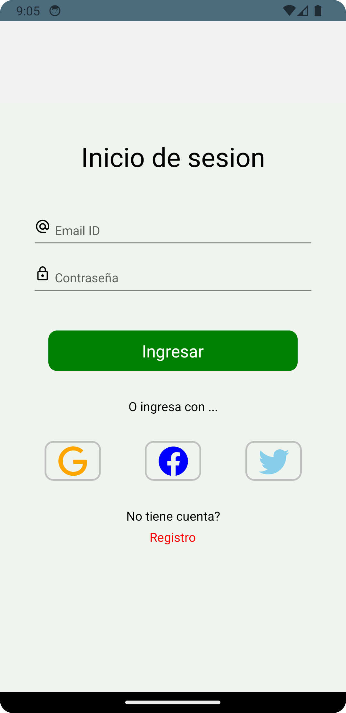
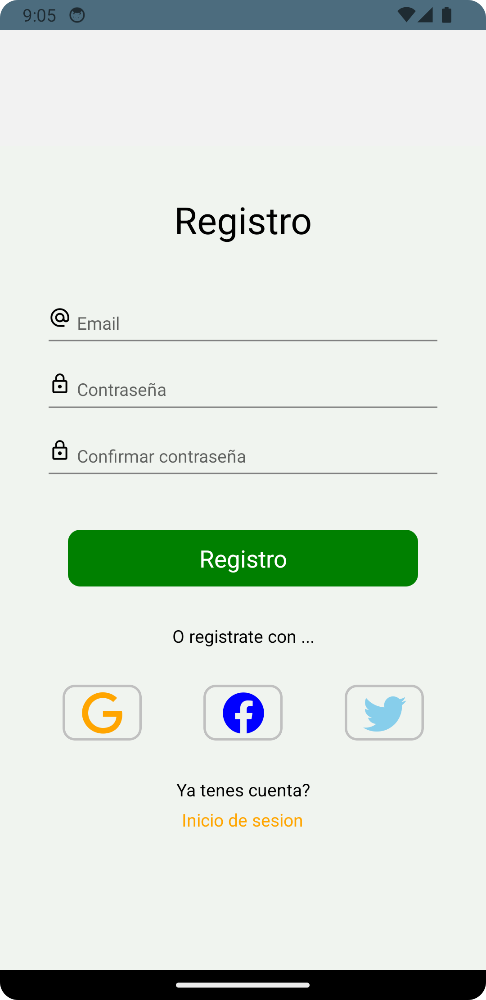

### Autenticacion con Firebase

- Utiliza el sistema de autenticacion de Firebase para gestionar el acceso de usuario.
- Permite a los usuarios iniciar sesion y registrarse de manera segura.

### Pantalla HomeGastos y HomeIngresos

- Muestra un grafico Donut con todos los gastos e ingresos añadidos por el usuario y el detalle de cada uno mas abajo.
- Al hacer click en el boton 'Mas' (+) se navega a la pantalla para añadir una nueva transaccion.

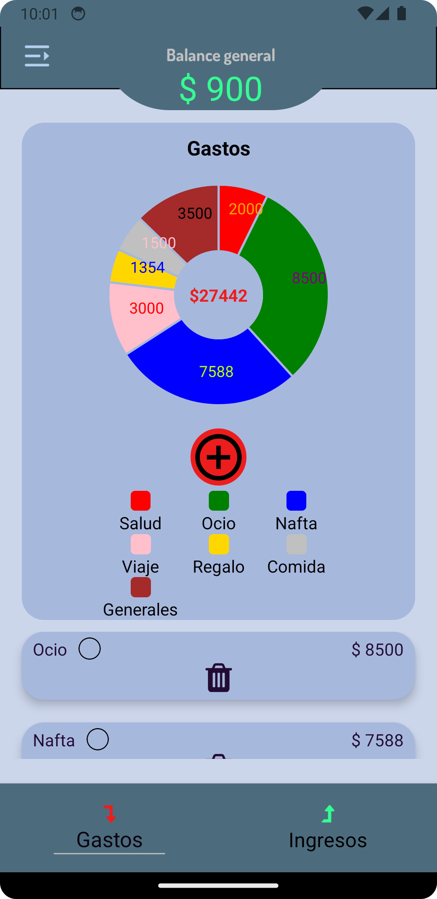
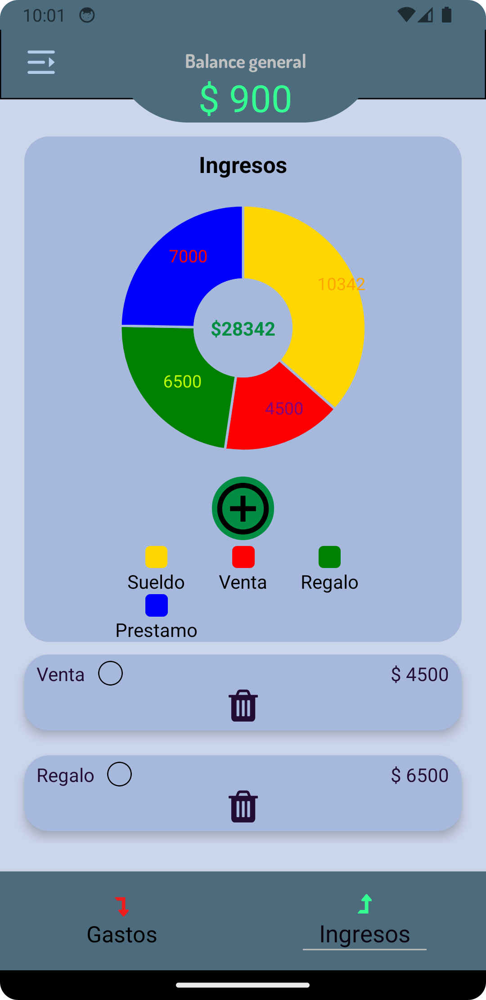

### Pantalla de Gastos e Ingresos

- Muestra botones arriba para añadir el monto y una descripcion breve y mas abajo todas las categorias para seleccionar una.
- Al hacer click en el boton se agregara la transaccion a la pantalla de HomeGasto/Ingreso.
- Al hacer click en el icono de basurero en las burbujas de montos/categorias se elimina este.

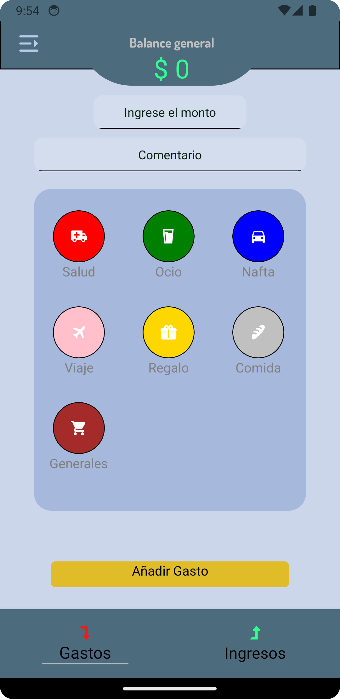
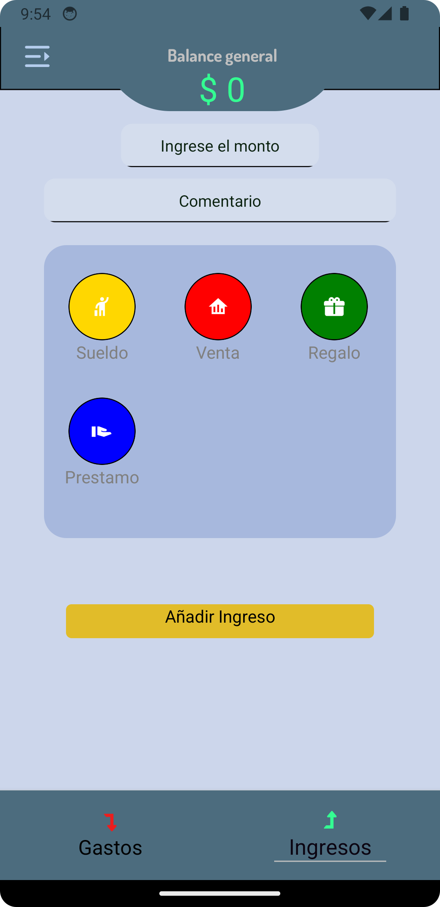

### Navegador Inferior

```javascript
const TabNavigator = () => {
    return (
        <Tab.Navigator
          initialRouteName='GastosHome'
          screenOptions={{
            headerShown:false,
            tabBarShowLabel:false,           
            tabBarStyle: Styles.tabbar,
          }
          }
        >
          <Tab.Screen 
            name='GastosHome' 
            component={GastosNavigator}
            options={{
              tabBarIcon: ({focused}) => {
                return <TabBarIcon title={'Gastos'} nameIcon={'level-down'} color={colors.redArrowDown} focused={focused}/>
              }
            }}
            />
          <Tab.Screen 
            name='IngresosHome'
            component={IngresosNavigator}
            options={{
              tabBarIcon: ({focused}) => {
                return <TabBarIcon title={'Ingresos'} nameIcon={'level-up'} color={colors.greenArrowUp} focused={focused}/>
              }
            }}
            />
        </Tab.Navigator>
    )
}
```

### Drawer Navigation 

- Mediante un Drawer se puede navegar al resto de la aplicacion, siendo las pestañas:
    - **Pestaña 1 - Inicio** Gastos e Ingresos (stack principal)
    - **Pestaña 2 - Perfil** Informacion del usuario, email e imagen de perfil.
    - **Pestaña 3 - Ajustes** Ajustes de la app
        - **Screen 1 - Editar Perfil** Cambiar Nombre e imagen de perfil
        - **Screen 2 - Seguridad** A realizar
        - **Screen 3 - Notificaciones** A realizar
        - **Screen 4 - Privacidad** A realizar

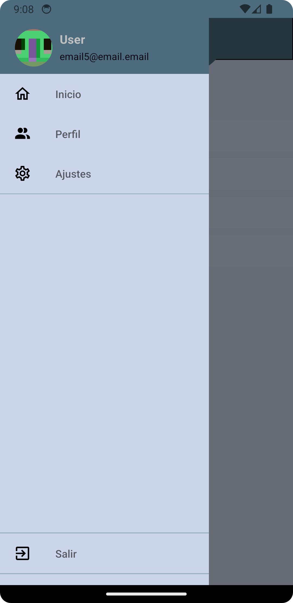
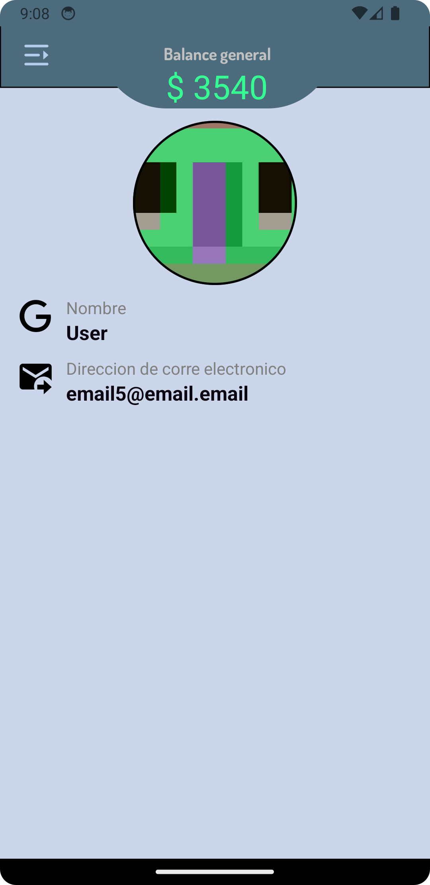

- **Al navegar a Editar Perfil se puede hacer click en Nombre o Fotografia para cambiar el nombre del usuario y la fotografia.**


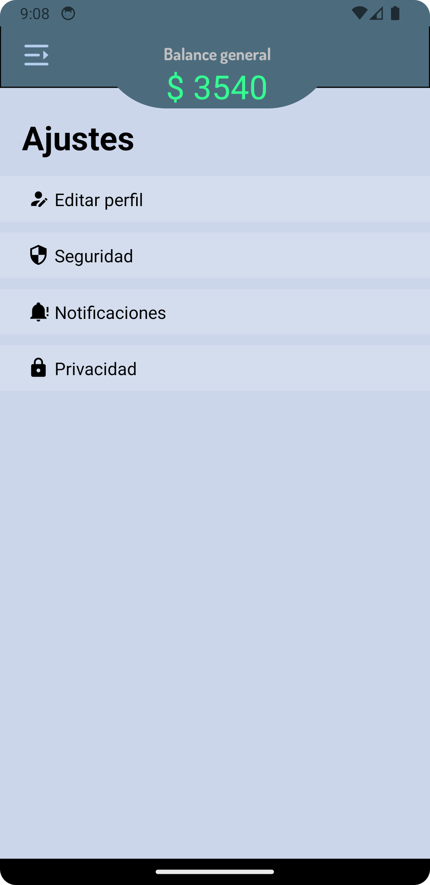
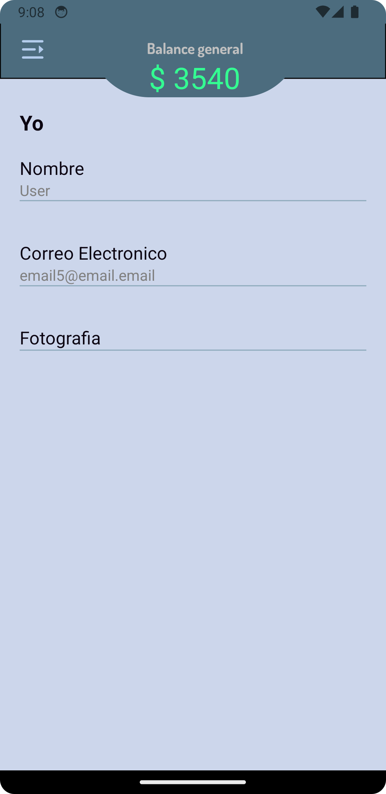
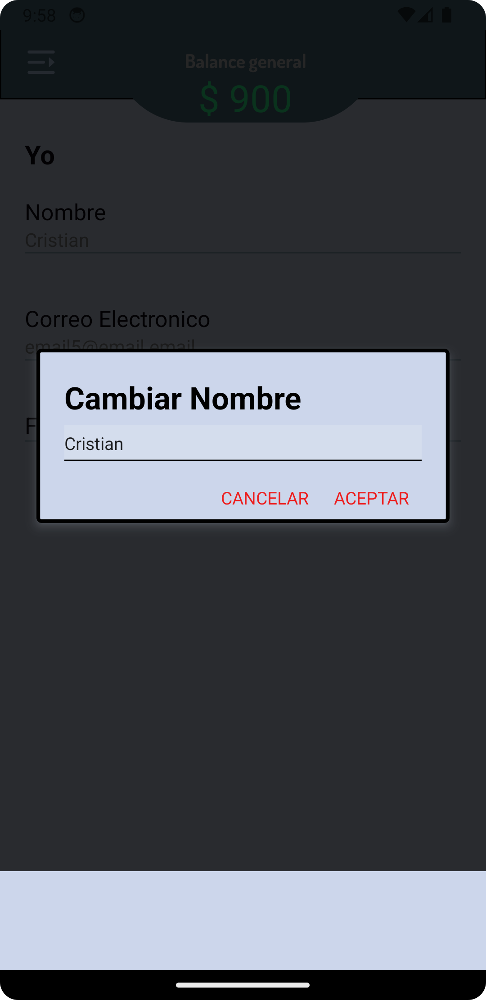
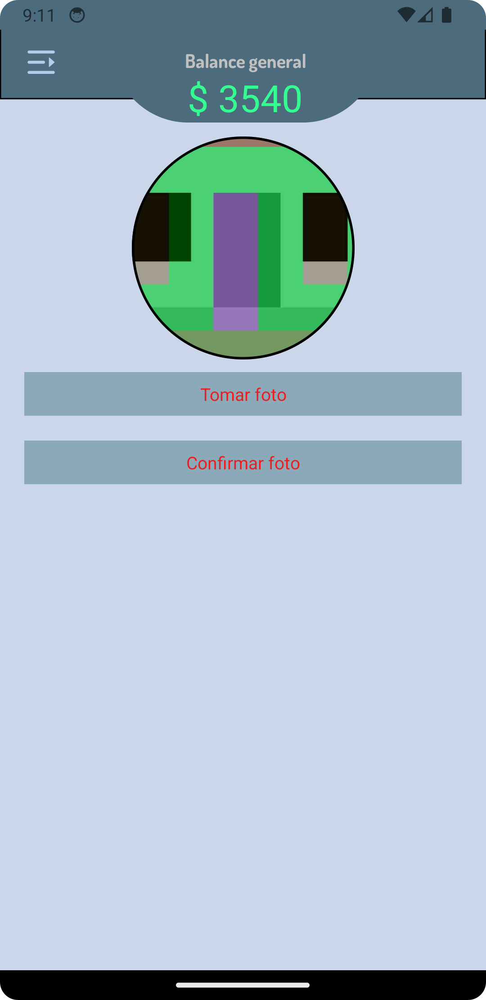


## Tecnologias Utilizadas

- Firebase Authentication: Implementa el sistema de autenticación de Firebase para gestionar la seguridad de la aplicación.
- React Native Navigation Stack: Gestiona la navegación entre pantallas.
- React Native Navigation Buttom tap: Gestiona la navegación entre pestañas.
- React Native Navigation Drawer: Crea un Drawer para navegar mediante un menu en las distintas pantallas.
- React Native Gifted Charts: Crea graficos y gestiona datos para la facil visualizacion de estos.
- Expo-Picker-Image: Facilita la carga de imágenes de perfil.
- Redux: Centraliza y gestiona el estado de la aplicación.
- RTK Query y Firebase: Realiza operaciones de lectura/escritura en la base de datos.

## Instalacion

1. Clona el repositorio: `git clone https://github.com/Criscab21/AppDeveloperCourse.git`
2. Instala las dependencias: `npm install`
3. Configura las claves de API para servicios externos (Expo-Location, Firebase, etc.).
4. Configura las credenciales de Firebase en tu proyecto.
5. Ejecuta la aplicación: `npm start`

## Contacto

Para preguntas o soporte, contacta a 
- cabrera.cristian.cod@gmail.com
- https://www.linkedin.com/in/cabreracristiandv/